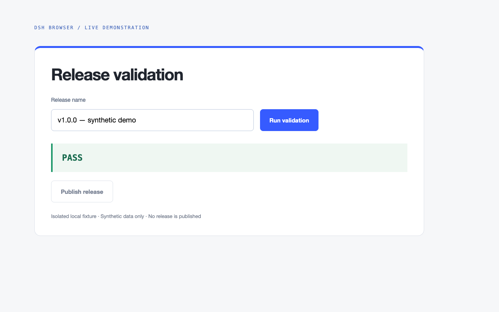

<h1 align="center">DSH Browser</h1>

<p align="center">
  <strong>面向 DeepSeek Harness、优先无头运行的隔离式浏览器自动化。</strong><br />
  <sub>托管 Chromium 会话 &bull; 语义引用 &bull; 限定范围观察 &bull; 有界证据</sub>
</p>

<p align="center">
  <sub>包名：<code>@zseven-w/dsh-browser</code> &middot; 版本：<code>0.1.0-rc.1</code> &middot; 预发布阶段</sub>
</p>

<p align="center">
  <a href="./README.md">English</a> &middot; <a href="./README.zh.md"><b>简体中文</b></a>
</p>

每个 Agent 独占一个临时 Chrome / Edge / Chromium 用户目录，并通过短期语义引用、确定性高风险拦截和有界证据进行操作。用 `npm install @zseven-w/dsh-browser` 安装；当前是预发布版本，契约（v9）在 rc 之间仍可能变化。

[快速开始](#快速开始) · [工具](#工具) · [安全边界](#安全与证据边界) · [本地开发](#本地开发) · [文档入口](#文档入口)

<p align="center">
  
</p>
<p align="center"><sub>Browser 驱动真实执行填写 → 点击 → 重新观察。画面是增加展示样式的本地测试页面，不是插件自带面板；全部使用合成数据。</sub></p>

## 产品边界

`dsh-browser` 不接管个人浏览器，也不会把 CSS Selector 暴露给模型。所有工具调用都由 `exec.agent.id` 隔离：Agent 只能观察和操作自己拥有的浏览器 Context。

```text
Agent A ── 临时 Chromium Context A ── opaque refs A
Agent B ── 临时 Chromium Context B ── opaque refs B
                                  └──── 有界 Console / Network 证据
```

插件同时提供 `zsevenBrowserDriver` 服务，作为后续 `dsh-qa` 的稳定编排接口。

## 快速开始

需要 Node.js `>=24.11.0`、pnpm，以及已安装的 Google Chrome、Microsoft Edge 或 Chromium。默认使用 Headless，不使用个人浏览器 Profile。

单独安装 DSH，然后在本仓库根目录构建：

```sh
npm install -g @deepseek-ai/dsh@latest
pnpm install
pnpm run build
```

将已构建的工作区链接到 DSH Web Profile：把占位路径替换为本仓库的绝对路径，然后重启 DSH。

```sh
dsh plugin --profile web add link:/path/to/dsh-browser
dsh web
```

用于生产或 QA 目标前，先配置 Operator 管理的[导航白名单](#operator-导航白名单)。依次调用 `browser_session_start`、`browser_observe`，使用新鲜 ref 执行动作，然后重新观察验证结果；结束时调用 `browser_session_stop`。`confirmed` 收据只证明输入已派发，不代表业务结果成功。

## 工具

| 工具 | 作用 |
| --- | --- |
| `browser_session_start` | 发现已安装的 Chrome / Edge / Chromium，启动独立 Context。 |
| `browser_observe` | 返回有界语义视图（整页，或通过 `within` 限定到某个元素的子树），以及绑定 epoch / fingerprint / expiry 的 opaque ref。 |
| `browser_act` | 实时重新解析并校验目标后执行 `click`、`fill`、`press`、`navigate`、`scroll`、`select` 或 `hover`。 |
| `browser_evidence` | 返回有界、脱敏的 Console 和 Network 元数据。 |
| `browser_session_stop` | 关闭 Context，删除对应的精确临时用户目录。 |

每次 `browser_act` 都返回收据：

- `confirmed`：浏览器完成了经校验的输入派发，但不代表业务结果一定成功。
- `unknown`：动作可能已派发，但取消、导航或运行时异常使最终状态无法确认。
- `rejected`：策略、过期引用、语义变化或 Hit Test 在派发前拒绝动作。
- `failed`：浏览器没能派发动作。

`scroll` 可滚动到视口外控件（按 ref，将目标居中）或翻页（`direction` + 可选 `amount`）；`select` 先按可访问标签、再按精确 value 选择原生 `<select>` 选项，无法匹配时直接失败而非猜测；`hover` 将指针停留在元素上，便于后续观察看到悬停才显示的内容。任何已派发的动作（包括 `scroll`）都会使观察失效，因此每次动作后都要重新观察。

## 限定范围观察（v8）

整页投影被限制在 100 个节点和 48 KiB 输出预算内，因此 DOM 顺序深处的目标（如信息框链接、页脚控件）无论视口如何都永远无法出现。`browser_observe` 支持可选的 `within` ref（来自最新一次观察，包括限定观察自身的 `scope.rootRef`）：驱动像解析动作 ref 一样解析它（同样的过期/失效规则与拒绝词汇），随后只从该元素的 flattened 子树收集语义节点 —— 相同的选择器、相同的 flattened slot / open shadow root 遍历、相同的原子 handle 捕获。`maxNodes`、字节上限、500 匹配扫描窗口与 iframe 截断标记全部变为子树相对：子树完整装下时返回 `truncated: false` 且无任何原因，容器内的“不存在”从此可被证明。结果的 `scope` 回显根节点（`{ ref, role, name, tag, rootRef }`；整页观察为 `null`），而每个节点的 `inViewport` 始终保持整页视口含义。拒绝一律 fail closed，绝不静默回退为整页视图：`REF_INVALID`（格式错误）、`OBSERVATION_REQUIRED`（观察已失效）、`REF_UNKNOWN`（未知或已消费的 ref）、`REF_EXPIRED`、`PAGE_CHANGED`、`TARGET_CHANGED`（已脱离或已被替换）、`TARGET_UNBINDABLE`（无活动绑定）、`WITHIN_NOT_ELEMENT`（根节点不是元素）以及 `SCOPE_UNAVAILABLE`（保留的 scope 根缺失，或因导航 / 下一次观察而被释放）。

## 身份与祖先链（v9）

投影是**可观察**语义节点的投影：被可见性门控跳过的选择器匹配（`visibility:hidden`、`display:none`、`opacity:0`、零/无 client rect）从不输出，`node-absent` 的含义是“没有可观察节点”。每次观察都会报告 `hiddenMatches` —— 扫描范围内被门控跳过的匹配数 —— 以及 `hiddenMatchesPartial`（当扫描窗口、节点预算或字节预算导致收集提前停止时为 `true`，即该计数是下界）。它是诊断信息，永远不会成为截断原因。

每个节点都带有 `parentRef`：在 composed tree 中（light-DOM 父链、经 slot 指派到 slot 的 flattened 父节点、并跨越 shadow root 到其 host）最近的、且在同一次观察中被输出的祖先节点的 ref；没有则为 `null`（整页视图第一个节点与每个限定视图的根节点都没有）。祖先在输出顺序上必然先于后代，因此节点的 `parentRef` 总是指向同一次观察中更早的节点。ref 每次观察都会重新铸造：消费方必须把祖先关系当作 RELATIONSHIP（父节点在同一视图内的下标，或 null）来比较，绝不能比较原始 ref 字符串。

每个节点还带有 `nameSource`，在与 `name` 相同的单次页面内求值中一并算出：当可访问名称来自作者书写的标签（`aria-label`、`aria-labelledby`、关联的 `<label>`、`alt`、`title`，或 `placeholder`、input-button 的 value 等其他作者书写属性/值）时为 `label`；当它由后代文本聚合而来（或为空）时为 `content`。内容命名且带容器角色的节点 —— `search`、`region`、`list`、`listbox`、`group`、`navigation`、`main`、`form`、`table`、`menu`（与 QA 层的 `CONTENT_NAMED_CONTAINER_ROLES` 一致）—— 在 `within` / 保留的 scope 根身份校验中会排除其 `name`：它的聚合名称会随后代文本变化而改变（维基百科“Part of a series on the History of China”侧栏正是典型 —— 角色 `navigation`、标签 `table`、约 180 字符的后代文本拼接，包含 hide/show 开关），但元素仍是同一个节点，因此 `observe({ within: <其 ref> })` 会正常解析而不再以 `TARGET_CHANGED` 拒绝，并通过 `scope.nameChanged: true` 信息性地报告名称变化（`scope.name` 携带新的聚合名称）。标签命名节点、非容器节点与 `act` 目标保持完整严格指纹 —— 对文本已变化的内容命名容器执行 `act` 仍然以 `TARGET_CHANGED` 拒绝，并携带 `changed: ['name']` 及 before/after 快照。

收集遍历是 flattened tree：light-DOM 子节点被指派到 OPEN shadow root 的 slot 时，恰好输出一次，位置是它实际渲染的 slot 位置（`HTMLSlotElement.assignedElements({flatten: true})` 会解析嵌套 slot；无指派时 slot 渲染其 fallback 内容）；shadow host 未被指派的 light 子节点没有 flattened 渲染位置，不会输出；slot 指派无法解析时，视图标记为 `truncated` 并给出原因 `slot-unresolved`。指派进 CLOSED shadow root 在页面内不可见（按规范 `assignedSlot` 为 null），留待 Phase C 的 CDP 覆盖探针处理。

限定观察的 `scope` 携带 `rootRef`：在**本次**观察中为该根元素铸造的 ref。根元素被输出时它就是 `nodes[0]` 且 `rootRef` 与其 ref 相同；当可见性门控把它排除时，根可能不在 `nodes` 中，但 `rootRef` 仍然绑定它 —— 后续 `observe({ within: scope.rootRef })` 会沿用同样的过期/失效词汇继续解析。

已派发动作会使铸造这些 ref 的观察失效，失效后**恰好有两个绑定**存活。其一是被动作的元素：`observe({ anchorLastAction: true })` 返回驱动最后一次派发动作所作用元素的身份锚点 —— 派发时使用的原始 handle，绝不经重新匹配。驱动按会话保留该 handle（每次已派发动作都会替换；无元素目标的动作会清除；导航/dispose 时释放），并在页面内校验该元素是否仍处于连接状态、是否位于 `within` 子树内（composed containment：parent/host/assignedSlot 链）。`anchor: { ref, connected, contained }` —— 元素在本次观察中被输出时 `ref` 是其新 ref（被门控或预算排除时为 `null`，此时 `connected`/`contained` 依然真实），整页观察时 `contained` 为 `null`。没有保留的动作目标时，调用以 `ANCHOR_UNAVAILABLE` 拒绝 —— 绝不静默返回 null。

另一个幸存者是 scope 根：当被动作消费的观察是限定观察时，驱动按会话保留它的 scope 根（连同该观察的 `scope` 元数据与它铸造的新 `rootRef`）。在下一次观察之前，`observe({ within: <该 scope.rootRef> })` —— 或字面别名 `within: 'last-scope'` —— 通过保留的 handle 解析，并把投影重新限定到**同一个**根上：长页面上从限定视图发起的滚动，其效果因此可以在该 scope 内被**证明**。保留的根通过与会话内 `within` ref 相同的 fail-closed 校验（`isConnected`、元素节点、身份一致性 —— `TARGET_CHANGED` / `WITHIN_NOT_ELEMENT`），并与 `anchorLastAction` 协同工作（锚点包含性相对该根度量）。该保留会被下一次已派发动作替换、在导航/dispose 时释放并销毁、被下一次成功观察消费（完全释放）；保留缺失或已释放 —— 以及**其他任何** ref，包括被消费观察中的普通节点 ref —— 一律以 `SCOPE_UNAVAILABLE` / 上述普通词汇拒绝，绝不回退为整页视图。

## 已验证边界（v9, Phase C）

`observe({ verifyCoverage: true })` 在收集完成后，对观察子树（`within` 根节点的子树；整页观察时为整个文档）运行一次**有界** CDP 探针，检测**所有**元素后代中的 CLOSED shadow root —— 包括非语义 host。closed root 在页面内不可见（`Element.shadowRoot` 为 null），因此即使 light tree 看起来完整，closed root 渲染的内容也缺失于投影。探针遍历 CDP DOM 树（`DOM.getDocument`/`DOM.describeNode`，depth -1 且 `pierce:true`；open root 被穿透，closed root 在其 host 上被检出，内嵌 frame 文档同样遍历），硬性上限为 5,000 个 DOM 节点和 250 ms，且每个受管会话复用一个惰性创建的 CDP session。每次观察都携带 `coverage: { verified, closedShadowRoots, probedNodes, reason? }`：

- `closedShadowRoots > 0` → 截断原因 `closed-shadow-root`，`truncated: true`（内容缺失于投影）。
- 探针未能完整跑完 —— `over-budget`（节点或时间上限）、`cdp-unavailable`（会话创建失败）、`root-unresolved`（within handle 无法映射到 CDP 后端节点）或 `error` → `verified: false` 并携带对应 `reason`，同时给出截断原因 `shadow-coverage-unverified`。被跳过、失败或超预算的探针一律如实报告自身原因 —— 绝不当作已验证。
- 探针完整跑完且未发现任何 closed root → `verified: true`。只有此时，消费方才可以把 `truncated: false` 解读为“子树的每个语义节点都在投影中”：使用 `verifyCoverage` 时，`coverage.verified:true` 意味着观察子树中不存在 closed shadow root；投影由可观察语义节点构成（light tree + open root + flattened slot + 被跟踪的 closed root：无 —— closed root 只被检出、从不被穿透）。
- 不使用 `verifyCoverage` 时，观察携带 `coverage: { verified: false, reason: 'skipped', closedShadowRoots: 0, probedNodes: 0 }`，且**不**增加任何截断原因：普通轮询在成本与 `truncated` 语义上完全不变。`verifyCoverage` 只用于终态“不存在”证明路径，绝不在 settle 轮询中使用。

## Operator 导航白名单

> **重要：** `allowedOrigins` 默认不限制顶层 HTTP(S) 导航。用于生产或 QA 时，应由 Operator 配置精确白名单；模型不能修改或传入这个配置。

```yaml
- id: dsh-browser
  name: '@zseven-w/dsh-browser'
  config:
    allowedOrigins:
      - https://staging.example.com
      - http://127.0.0.1:4173
    idleTimeoutMs: 900000
```

白名单会在启动和显式导航前校验，在 Chromium Document Request 层拦截重定向，并在顶层页面变化后再次校验。空数组只允许 `about:blank`。该策略限制顶层文档，不限制白名单页面加载的 CDN / API 子资源。

注入的 `storageState` 同样经过校验：每个 `localStorage` origin 必须精确匹配白名单；每个 Cookie 的 host 必须映射到某个白名单 origin 的 host（校验前导点域名与 IP 字面量）。Cookie 由浏览器按 host 作用域发送：一旦注入，会被发送到该 host 的 **所有端口与协议** —— 包括发往白名单之外 origin 的子资源请求 —— 因此白名单无法收窄 Cookie 的投递范围；只应注入 Operator 自有 host 的 Cookie。

## 安全与证据边界

- 不相信模型传入的敏感标记，而是根据实时目标语义拒绝删除、付款、发送/发布、安全设置、密码、上传和下载动作。
- Ref 是 HMAC 派生的 opaque 值，只有最新且未过期的一次观察可操作。
- 操作前重新采集语义并核对 fingerprint，再做中心点 Hit Test。`TARGET_CHANGED` 拒绝会携带 `changed`（发生变化的身份字段，如 `['name']`、`['visible']` 或 `['detached']`）以及安全子集（`role`、`name`、`tag`、`disabled`、`visible`）的 `before`/`after` 快照——绝不包含任何值。
- 自动取消下载，自动关闭 JavaScript Dialog。
- Console 有数量和长度上限，并对常见凭据模式脱敏。
- Network 仅返回 method、status/failure、resource type 和去掉凭据、query、fragment 的 URL，不返回 header 或 body。
- 取消操作会关闭独立 Context，避免已超时动作在后台继续执行。

## 本地开发

需要 Node.js `>=24.11.0`、pnpm，以及已安装的 Google Chrome、Microsoft Edge 或 Chromium。非标准安装位置可由 Operator 设置 `DSHPLUGIN_BROWSER_EXECUTABLE_PATH`。

```sh
pnpm install
pnpm run build
pnpm run typecheck
pnpm test
pnpm run smoke:pack
```

通过[快速开始](#快速开始)中的本地链接方式将构建结果载入 DSH。构建和测试命令不会发布 registry 包。

## Driver Contract

```ts
import {
  BROWSER_DRIVER_SERVICE, // "zsevenBrowserDriver"
  BROWSER_DRIVER_CONTRACT_VERSION, // 9
  type ZSevenBrowserDriver,
} from '@zseven-w/dsh-browser/driver'
```

服务会声明 `kind: "browser"` 和 `contractVersion: 9`（v9：每个节点都带 `parentRef` —— 最近被输出的 composed 祖先；限定 `scope` 携带新的 `rootRef`，即使根被门控排除仍保持绑定；`observe({ anchorLastAction: true })` 返回最后动作元素的身份锚点，否则以 `ANCHOR_UNAVAILABLE` 拒绝；已派发动作会保留被消费限定观察的 scope 根，因此 `observe({ within: scope.rootRef })` 或 `within: 'last-scope'` 会在下一次观察之前持续重新限定到该根，保留消失后以 `SCOPE_UNAVAILABLE` 拒绝；遍历遵循 flattened slot 指派，无法解析时标记 `slot-unresolved`；观察报告 `hiddenMatches`/`hiddenMatchesPartial`；Phase C 新增 `observe({ verifyCoverage: true })` —— 有界 CDP closed-shadow-root 探针，其每次观察的 `coverage` 证据是把 `truncated:false` 解读为完整投影的唯一依据。v8：`observe` 支持可选的 `within` ref，将投影限定到某个元素的子树并使用子树相对预算，每次观察都会报告 `scope`；v7 新增了 `bindable` 节点标记，且每个节点都带 `nameSource`（作者书写名称为 `label`，后代文本聚合为 `content`）：内容命名的容器角色在 `within`/保留 scope 根身份校验中排除 `name`，聚合名称变化以 `scope.nameChanged` 信息性报告，见 `BrowserSemanticNode`）。`visualObserve` 方法只捕获有界 PNG 与 Set-of-Mark 标签（像素 + 框），不做任何理解、OCR 或差异对比。上层插件应通过 Cordis `ctx.inject([BROWSER_DRIVER_SERVICE], ...)` 获取，不应导入 Manager 内部实现，也不能跨 Agent 复用模型 Ref。`disposeScope(ownerId)` 会同时等待迟到的启动并关闭已运行 Session；插件通过结构化 `agent/disposed` 生命周期钩子调用它。

## 已验证范围与限制

本地集成门禁会启动已安装的 Headless Chrome，用两个 Agent Context 访问本地 HTTP Fixture，验证语义输入/点击、陈旧及跨 Agent Ref 拒绝、高风险拒绝、Origin 策略、证据脱敏与临时目录清理。Packed Smoke 会真实 `npm pack`、全新安装，并从安装后的包启动托管浏览器。

当前明确限制：

- 仅支持 Chromium 系浏览器，未实现 Firefox / WebKit。
- 当前是主文档语义 DOM 投影。所有 `<iframe>` / `<frame>` 内容（包括同源）暂不在范围内：观察会设置 `truncated` 并给出原因 `iframe-not-traversed`。closed shadow root 渲染的内容 —— 包括指派进其中 slot 的元素 —— 只被检出、从不被穿透：使用 `verifyCoverage` 时，有界 CDP 探针以 `closed-shadow-root` 标记此类根（见“已验证边界”一节）；不使用它时，投影只覆盖可观察语义节点，且不对 closed root 作任何断言。
- `visualObserve` 只做捕获（像素 + Set-of-Mark 标签）；视觉理解由 DSH Harness 的视觉模型完成。
- 驱动不会接管现有浏览器 Profile、浏览器扩展或已登录 Tab。登录态只能通过显式授权的 `storageState` 选项预加载（见导航策略一节）；注入的 Cookie 按 host 作用域发送，会到达该 host 的所有端口与协议。
- 已验收路径是 Headless；Headful 参数存在，但尚未获得同等集成覆盖。
- 确定性风险匹配只是拒绝层，不是完整的用户审批系统；上层 QA 工作流仍需自己的授权策略。

## 文档入口

- [English](README.md) — 本指南的英文版本。
- [Driver Contract](#driver-contract) 与 [TypeScript 定义](src/driver-contract.ts) — 面向编排消费方的集成接口。
- [限定范围观察](#限定范围观察v8)、[身份与祖先链](#身份与祖先链v9)及[已验证边界](#已验证边界v9-phase-c) — 引用生命周期与“不存在”证明的语义。
- [已验证范围与限制](#已验证范围与限制) — 集成门禁的覆盖范围与未覆盖项。
- [第三方声明](THIRD_PARTY_NOTICES.md)。

## 许可证

[MIT](LICENSE)
